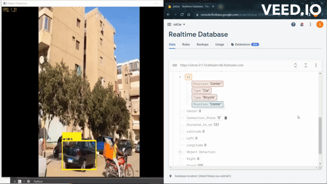

# Object Detection with Single Shot Detector (SSD)

[]

This is a Python project that uses a pre-trained SSD model to detect and label objects in a video stream or from a video file. The code supports different types of SSD models, including VGG16, MobileNetv1, MobileNetv1 lite, MobileNetv2 lite, MobileNetv3 large lite, and SqueezeNet lite. The model is loaded from a specified path, and the labels for the detected objects are loaded from a separate file.

The code captures video input from either a camera or file, and then processes the frames to detect objects using the SSD model. The detected objects are then labeled with their corresponding class names and confidence scores. The code also draws bounding boxes around the detected objects. Additionally, it calculates the frames per second (FPS) and displays it on the output frame.

This project uses OpenCV for image processing, NumPy for numerical operations, and PIL for image manipulation. It also uses Mss to capture the screen.

To run the code, simply specify the type of SSD model, model path, and label path as command-line arguments. The code supports the detection of three types of objects: person, chair, and car. The class of the detected object is printed on the console.

This project provides a simple and efficient way to perform object detection using pre-trained models. It can be easily modified to detect other objectsor to use other pre-trained models. It is useful for a variety of applications, including surveillance, traffic monitoring, and robotics.

# Requirements

- Python 3.7 or newer versions
- OpenCV
- NumPy
- PySerial (Optional)
- Firebase_admin(Optional)

# Training your own model

For training your own model you can run the 'SSD_Train.py' on 'Spyder' or on the 'CMD terminal' however you should update the data fitted to the train based on your objectives.

# Usage

To run the code, use the following command on CMD or Anaconda Prompt:

`Live_Detection_Positioning_Streaming.py <net type> <model path> <label path> [video file]`

where <net type> is the type of SSD model to use (vgg16-ssd, mb1-ssd, mb1-ssd-lite, mb2-ssd-lite, mb3-large-ssd-lite, or sq-ssd-lite), <model path> is the path to the pre-trained model file, <label path> is the path to the label file, and [video file] (optional) is the path to the video file to process. If no video file is specified, the code will capture input from the camera.

# Acknowledgements
  
This project is based on the SSD implementation in PyTorch by Max deGroot and Ellis Brown. The code is modified to use OpenCV and other libraries to perform object detection in real time.
